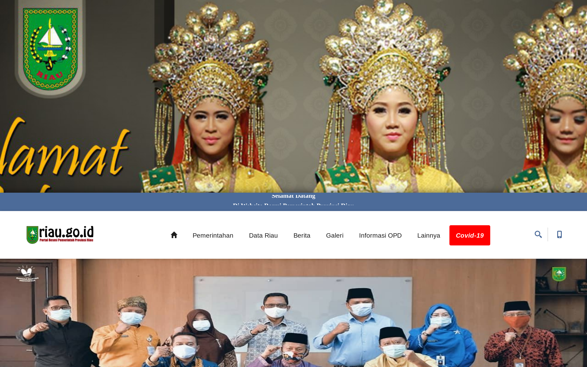

# Awesome Riau Project
Project yang didedikasikan kepada perkembangan Riau kedepan

## Pendataan seluruh website instansi pemerintahan
Perkembangan teknologi semakin menguat akhir-akhir ini, kita tidak boleh ketinggalan informasi terbaru agar kita tidak tertinggal dari provinsi maupun negara lain. Instansi pemerintahan merupakan jantung dari perkembangan sebuah wilayah yang dapat mengelola setiap kegiatan yang berhubungan dengan perkembangan ekonomi maupun hal lainnya. Website profil merupakan tempat masyarakat dalam mencari informasi terkait kepengurusan pemerintahan maupun menyebarkan informasi yang vital. 

Project ini dimaksudkan untuk mendata seluruh website profil yang berbasis instansi pemerintah, entah itu Pemerintah Daerah(PEMDA), Pemerintah Kota(PEMKO), Pemerintah Kabupaten(PEMKAB) ataupun instansi kampus maupun sekolah. Tujuan utama dari project ini kita akan melakukan sebuah research terhadap website pemerintahan untuk mengambil data yang dikira penting untuk tujuan bersama.

### apa yang didata?
Pada project ini data yang kiranya diambil adalah
* screenshoot dari halaman depan web tersebut   
   ini bisa berguna untuk mengecek seberapa updatenya website tersebut, kita bisa sekalian belajar menggunakan machine learning untuk mengecek familiar dari gambar tersebut, apabila sering berubah maka pertana website tersebut sering update    

* mengecek speed performance dengan menggunakan tools GT Metrix
* mengecek teknologi apa yang digunakan oleh website tersebut, entah itu php, wordpress, ataupun stack lainnya
* mengecek score dari Search Engine Optimization(SEO) dari website tersebut

### ingin berkontribusi?
kami berharap teman-teman dapat membantu pendataan ini, untuk kemajuan bersama. silahkan `merge request` branch master ini, dan listkan data tersebut.    

### punya saran data apa yang kiranya bisa diambil lagi? 
bantu kami dengan `mensubmit` issues, dan jelaskan saran anda

### bingung menggunakan markdown? 
silahkan cek link berikut [github.com/adam-p/markdown-here/wiki/Markdown-Cheatsheet](https://github.com/adam-p/markdown-here/wiki/Markdown-Cheatsheet)

## Data Website

### https://riau.go.id -> Website Resmi Pemerintah Daerah Riau

   
Foto Website

   

### http://bpkad.riau.go.id -> Badan Pengelola Keuangan dan Aset Daerah
### http://bappeda.riau.go.id/web/
### https://badanpendapatan.riau.go.id/
### http://bkd.riau.go.id/
### http://balitbang.riau.go.id/
### http://bpbd.riau.go.id/
### https://bpsdm.riau.go.id/bpsdm/
### http://pupr.riau.go.id/
### http://esdm.riau.go.id/web/
### http://dkp.riau.go.id/
### http://disperin.riau.go.id/
### http://dinsos.riau.go.id/web/
### https://dipersip.riau.go.id/
### http://dpmptsp.riau.go.id/
### http://disnakertrans.riau.go.id/
### http://dpppa.riau.go.id/
### http://dispkh.riau.go.id/
### http://pmd.riau.go.id/
### http://disdukcapildaldukkb.riau.go.id/
### http://disdagkop-ukm.riau.go.id/
### https://dishub.riau.go.id/
### http://dispora.riau.go.id/
### http://dislhk.riau.go.id/
### http://pariwisata.riau.go.id/
### http://dinkes.riau.go.id/
### http://disbud.riau.go.id/
### http://disdik.riau.go.id/
### http://diskominfotik.riau.go.id/
### http://distanbun.riau.go.id/
### http://pkpp.riau.go.id/
### http://biroumum.riau.go.id/
### https://humas.riau.go.id/home/
### http://bap.riau.go.id/
### https://jdih.riau.go.id/
### http://tapem.riau.go.id/webtapem/
### http://rsudpetalabumi.riau.go.id/
### http://rsudarifinachmad.riau.go.id/
### http://rsjiwatampan.riau.go.id/
### http://dprd.riau.go.id/
### http://satpolpp.riau.go.id/
### http://www.pekanbaru.go.id/
### http://www.pekanbaru.go.id
### https://dumaikota.go.id/
### https://siakkab.go.id/
### https://www.rohilkab.go.id/
### http://www.rokanhulukab.go.id/
### https://www.kuansing.go.id/
### https://kamparkab.go.id/
### http://inhukab.go.id/
### https://bengkaliskab.go.id/
### http://merantikab.go.id/
### https://www.inhilkab.go.id/
### http://www.pelalawankab.go.id/portal/
